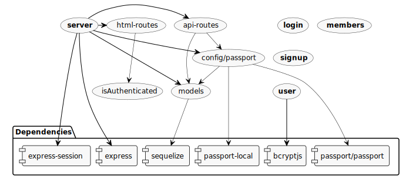
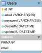

# bootcamp-homework-014

This is a sample Node.js application that demonstrates the use of Sequelize and 
the Passport (See http://www.passportjs.org/docs/) authentication library using a local strategy (See http://www.passportjs.org/packages/passport-local/)

## Requirements

1. MySQL Server must be installed on the machine

## Running

1. Download the repository to your computer
2. Open the downloaded folder in a file explorer
3. Modify the `config/config.json` file with the details of your database
4. Open the terminal
5. Navigate to the repository root
6. Import the database schema
    ```sh
    mysql -u root -p -vvv < db/schema.sql
    ```
7. Install the dependencies by executing
    ```sh
    npm install
    ```
8. Run the server by executing
    ```sh
    node server.js
    ```
9. Open your browser at http://localhost:8080/
10. Register an account and login with it afterwards

## Application Walkthrough

### Architecture Diagram

The diagram below was generated using `arkit` (See https://arkit.pro/). To re-generate it you can run the command below:

**NOTE**: You need internet connection for the diagram to be converted to an SVG
file

```sh
npm run architecture_diagram
```



### About Passport

**Passport** is an **authentication library** for Node.js. It can work with
Express.js to authenticate users in a web application. Passport splits the core
authentication logic from the actual **login method** which they call
**_Strategy_**. A _Strategy_ encompasses the means of authentication, which
could be via Facebook, Twitter, Google, Local (Self-managed users and passwords)
or others

#### Passport Local Strategy

The Passport local _Strategy_ allows developers to fully control the user
registration allowing to save the user and password in a local database.

### File Structure

#### /.gitignore

Includes file patterns to ignore when commiting files into the repository

#### /activity_instructions.md

The instructions given for this activity

#### /package.json

This file contains project information including the dependencies for the
project, which in this case are:

- `express`: A simple HTTP Server library for Node.js
- `mysql2`: MySQL dependency for `sequelize`
- `sequelize`: An ORM (Object-Relation Map) to handle relational databases
- `passport-local`: The local strategy dependency for the `passport` library
- `passport`: An authentication library for Node.js
- `bcryptjs`: A library to help hash passwords for them to be safe to save into
    a database. A hash is a string (In this case 60 characters long) which
    represents a string of text; it doesn't matter if the string is 1 character
    long or 200 characters long, a hash will always have the same length. A hash
    is generated by processing the string with several mathematical functions
    that make it theoretically impossible to revert the hash to the original
    string. The way we validate a password is correct, the process is to hash
    the input password and checking if the saved hash matches with the hash of
    the provided password
- `express-session`: This is a library to manage data in a session, which is
    useful to keep things like a shopping cart or other details

#### /package-lock.json

This file gets created after the execution of `npm install`. It contains the
fixed versions of the dependencies that are downloaded. When this file is
committed to the repository, the next time the application is installed, `npm` will make sure that the exact same versions of the dependencies are installed

#### /README.md

This file

#### /server.js

The main file of the application. This file initializes Express.js with all of
the dependencies needed and imports the routes of the application from other
files in the project

#### /config

This folder contains configuration files for Passport and Sequelize

##### /config/config.json

This JSON file contains the configuration for Sequelize to connect to the MySQL
database. This file was created with the Sequelize CLI by executing the
following:

```sh
sequelize init:config
```

**IMPORTANT**: The details here should be changed to match those of your local database to start developing the application

##### /config/passport.js

This is the configuration file for Passport. In it, passport is told to use the
"Local" strategy to allow us to manage the users ourselves. This file also
defines how authentication should behave.

In this case, when we receive an authentication call we check if the e-mail we
were passed is already registered in the database by using our `User` Sequelize
model to query for a user registered with that e-mail.

The following describes our authentication flow:

- If a user with the provided email is not found in the database, then we call
    the Passport's `done` function (Which in the documentation is called _verify
    callback_) and set the second parameter to `false`, which means
    authentication failed
- If the user was found in our database we attempt to check if the password is
    correct by using our `User` model `validPassword` which in turn will call
    the `bcrypt`'s `compareSync` function which compares the passport passed to
    the function with the encrypted version saved in the database.
    - If the password doesn't match we call the Passport's `done` function with
        its second parameter set to `false`, which means authentication failed
    - If the password matches then Passport's `done` function is called with the
        second parameter set to the record in the database corresponding to the
        email that was passed, which means authentication succeeded

##### /config/middleware

Stores files that will be used as Express.js middleware functions. According to
the Express.js documentation at https://expressjs.com/en/guide/using-middleware.html

> Middleware functions are functions that have access to the request object
> (`req`), the response object (`res`), and the next middleware function in the
> application’s request-response cycle. The next middleware function is commonly
> denoted by a variable named `next`.
>
> Middleware functions can perform the following tasks:
>
> - Execute any code.
> - Make changes to the request and the response objects.
> - End the request-response cycle.
> - Call the next middleware function in the stack.

This means that a middleware function is a function that can make further
processing of the request and response objects. Popular middlewares in Express
are:

- The `json` middleware, which processes JSON objects sent in the request body
    to a route
- The `urlencoded` middleware which can process form data sent by an HTML form

The middleware functions stores in this directory are custom.

###### /config/middleware/isAuthenticated.js

This file contains a function that checks if the response contains a `user` key
and if it does, then we execute the `next` middleware function, if it doesn't then it redirects the user to the server's root.

**NOTE**: This function may need to be changed to the example function used in
the documentation:

```js
app.get(
    '/members',
    passport.authenticate(
        'local',
        {
            successRedirect: '/members',
            failureRedirect: '/'
        }
    )
);
```

##### /db

A folder that contains the database creation file

###### /db/schema.db

This file contains commands to create a MySQL database that Sequelize later
connects to in order to create the tables from the models and execute SQL
commands

##### /models

This folder contains all the Sequelize models plus an `index.js` file that
allows importing all of the models in the folder

###### /models/index.js

This file was created by the Sequelize CLI when using the command:

```sh
sequelize init:models
```

###### /models/user.js

This file contains the Sequelize `User` model which creates the following table:



The model only defines two columns:

- `email`: This will be used to store our username in the application
- `password`: This will be used to store hashed passwords

The model also defines a custom method called `validPassword` that receives a
password as a parameter and compares its hashed version to the one currently in
the database

The model also defines a Hook. According to the documentation at
[https://sequelize.org/master/manual/hooks.html]():

> Hooks (also known as lifecycle events), are functions which are called before
> and after calls in sequelize are executed. For example, if you want to always
> set a value on a model before saving it, you can add a beforeUpdate hook.

The model has a `beforeCreate` hook which hashes the password set to the model
before saving it into the database

##### /public

This folder is the root of the server, all files here will be made available for
use by the users

###### /public/login.html

The markup for the login form. This file imports

- `Bootstrap`
- A local stylesheet `style.css`
- `jQuery`
- The login js file `login.js`

###### /public/members.html

The markup for the members page. This file imports:

- `Bootstrap`
- A local stylesheet `style.css`
- `jQuery`
- The login js file `members.js`

**NOTE**: This file shouldn't be in the public folder, as it can be seen by everyone by accessing `http://localhost:8080/members.html`

###### /public/signup.html

The markup for the sign-up form. This file imports:

- `Bootstrap`
- A local stylesheet `style.css`
- `jQuery`
- The login js file `signup.js`

###### /public/js

This folder contains JavaScript files that call the API routes to present
information in the UI

###### /public/js/login.js

This file manages the form created in the `/public/login.html` form. Whenever
the form contains both a user and a password is submitted, the `loginUser`
function is called and it in turn 